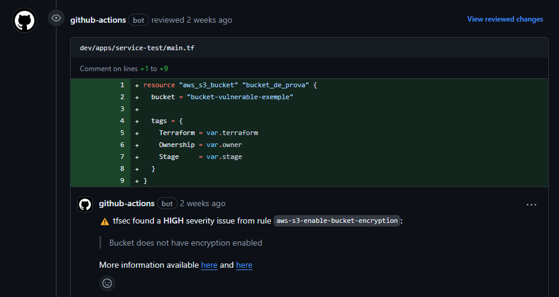

# tfg-base-repo

This repository serves as a possible solution to a scalable Terraform monorepo, providing all the essential components for managing and creating Infrastructure as Code (IaC), with a robust CI/CD pipeline using **Terragrunt**, **TFSec**, and **Infracost**.

## Structure
The repository is organized into three environments: `dev`, `staging`, and `prod`. Following a GitOps philosophy, the code in the repository reflects the actual state of the infrastructure. Each environment has the following structure:

- `base`: Contains resources managed by the platform team. Only the platform team is allowed to merge requests (MR).
- `apps`: Contains the Terraform modules for projects managed by developers. Developers must create folders per project, e.g., `dev/apps/portfolio`.

When creating a new service, developers must copy existing service files and modify them as needed. See this example: [prod/base/terraform](https://github.com/JordiiBru/tfg-base-repo/tree/main/prod/base/terraform).

## Workflow

## Terraform Modules Catalog

| Module Name | Description |
|-------------|-------------|
| [tf-static-website](https://github.com/JordiiBru/tf-static-website) | Sets up all the necessary resources to deploy a static website hosted in an S3 bucket. |
| [aws-cloudfront](https://github.com/JordiiBru/aws-cloudfront) | Creates a CloudFront distribution for a hosting S3 bucket with optional configurations. |
| [aws-route53](https://github.com/JordiiBru/aws-route53) | Creates Route 53 records in the jordibru.cloud hosted zone. |
| [aws-s3-bucket](https://github.com/JordiiBru/aws-s3-bucket) | Creates an AWS S3 Bucket with optional configurations. |
| [aws-acm](https://github.com/JordiiBru/aws-acm) | Creates an ACM (AWS Certificate Manager) certificate with Route 53 resources for DNS validation. |

## Screenshots

### TFSec

### Plan

### Infracost

